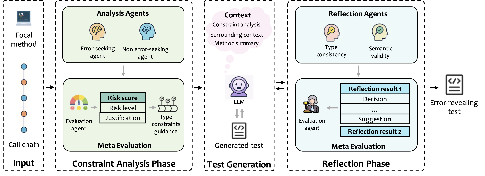

# RTED

This is the implementation of **RTED**: *Reflective Unit Test Generation for Precise Type Error Detection with Large Language Models*.

## Introduction

Type errors in Python often lead to runtime failures, posing significant challenges to software reliability and developer productivity. While static analysis tools aim to detect such errors without code execution, they frequently suffer from high false positive rates.
Recently, unit test generation techniques have shown promise in achieving high coverage, but they often struggle to produce **bug-revealing** tests without tailored guidance.
To address these limitations, we propose **RTED**, a novel **type-aware test generation framework** for automatically detecting Python type errors. RTED combines **step-by-step type constraint analysis** with **reflective validation** to guide test generation and effectively suppress false positives.


<p align="center"><b>Figure 1:</b> Overview of RTED</p>

## Repository Structure

```
RTED
│
├── core/                  # Core definitions (e.g., LLM interface, unit test abstractions)
├── data/                  # Experimental data and configuration files
├── utils/                 # Utility scripts
```

## Workflow Overview

The workflow consists of 5 main steps:

1. **Benchmark Setup and Preprocessing** (Steps 0)
2. **Focal Method Extraction** (Step 1) 
3. **Call Chain Processing** (Step 2)
4. **Type Constraint Inference** (Step 3)
5. **Test Generation and Validation** (Step 4)

---

## Step 0: Benchmark Setup and Preprocessing

### 0_preprocess_bugs_in_py.py

**Purpose**: Sets up BugSinPy benchmarks including cloning repositories, creating conda environments, and preparing buggy/fixed/focal versions.

**Input Configuration**:

- `bugs_in_py_info_file`: JSON file containing all bug information and repository URLs
- `bugs_in_py_base_proj_dir`: Directory to store cloned repositories
- `bugs_in_py_checkout_proj_dir`: Directory to store bug-specific versions
- `bugs_in_py_meta_data_dir`: Metadata directory with requirements.txt and test.sh files

All configurations are set by default in `data/configurations.py`.

**Output**:

- Cloned repositories in `bugs_in_py_base_proj_dir`
- Conda environments named `{proj_name}_{bug_id}_env`
- Focal, fixed, and buggy versions in `bugs_in_py_checkout_proj_dir/{proj}/{bug_id}/{focal|fixed|buggy}/`


**Command**:

```bash
python 0_preprocess_bugs_in_py.py
```

### 0_preprocess_typebugs.py

**Purpose**: Sets up TypeBugs benchmarks with similar functionality to the above.

**Input Configuration**:

- `typebugs_info_file`: JSON file containing TypeBugs bug information and repository URLs
- `typebugs_base_proj_dir`: Directory to store cloned repositories
- `typebugs_checkout_proj_dir`: Directory to store bug-specific versions
- `typebugs_meta_data_dir`: Metadata directory with requirements.txt and test.sh files

All configurations are set by default in `data/configurations.py`.

**Output**:

- Cloned repositories in `typebugs_base_proj_dir`
- Conda environments named `{bug_id}_env`
- Focal and fixed versions in `typebugs_checkout_proj_dir/{proj}/{bug_id}_{single_id}/{focal|fixed}/`

**Command**:

```bash
python 0_preprocess_typebugs.py
```

---

## Step 1: Focal Method Extraction

### 1_extract_triggering_focal_method_bugsinpy.py

**Purpose**: Extracts method calls from failing tests in BugsinPy datasets to identify focal methods.

**Input Configuration**:

- `bugs_in_py_info_file`: Bug information JSON file
- `bugs_in_py_checkout_proj_dir`: Directory with prepared bug versions
- `bugs_in_py_meta_data_dir`: Metadata with test files information

All configurations are set by default in `data/configurations.py`.

**Output**:

- Pickle file: `data/extracted_focal_methods_bugsinpy.pkl`
- Contains call chains and failed methods extracted from test execution output

**Command**:

```bash
python 1_extract_triggering_focal_method_bugsinpy.py
```

### 1_extract_triggering_focal_method_typebugs.py

**Purpose**: Extracts method calls from failing tests in TypeBugs datasets.

**Input Configuration**:

- `typebugs_info_file`: TypeBugs information JSON file
- `typebugs_checkout_proj_dir`: Directory with prepared bug versions
- `typebugs_meta_data_dir`: Metadata with test file information
- `typebugs_setup_info_dir`: Setup information directory

All configurations are set by default in `data/configurations.py`.

**Output**:

- Pickle file: `data/extracted_focal_methods_typebugs.pkl`
- Contains call chains and failed methods extracted from test execution output

**Command**:

```bash
python 1_extract_triggering_focal_method_typebugs.py
```

### 1_extract_triggering_focal_method_non_buggy.py

**Purpose**: Converts focal (buggy) methods to fixed (non-buggy) methods

**Input Configuration**:

- `data/extracted_focal_methods_typebugs.pkl`: TypeBugs focal methods
- `data/extracted_focal_methods_bugsinpy.pkl`: BugsinPy focal methods

**Output**:

- `data/extracted_focal_methods_typebugs_non_buggy.pkl`
- `data/extracted_focal_methods_bugsinpy_non_buggy.pkl`
- Fixed version methods

The configurations are specified in the beginning of the `__main__` method.

**Command**:

```bash
python 1_extract_triggering_focal_method_non_buggy.py
```

---

## Step 2: Call Chain Processing

### 2_process_call_chain.py

**Purpose**: Processes call chains by extracting function parameters and analyzing function calls for both buggy versions.

**Input Configuration**:

- `data/extracted_focal_methods_typebugs.pkl`: Extracted TypeBugs focal methods
- `data/extracted_focal_methods_bugsinpy.pkl`: Extracted BugsinPy focal methods

**Output**:

- `data/call_chain_info_typebugs.json`: Processed TypeBugs call chain information
- `data/call_chain_info_bugsinpy.json`: Processed BugsinPy call chain information
- Contains function content, parameters, and call relationships

The configurations are specified in the beginning of the `__main__` method.

**Command**:

```bash
python 2_process_call_chain.py
```

### 2_process_call_chain_non_buggy.py

**Purpose**: Processes call chains for non-buggy versions (fixed code).

**Input Configuration**:

- `data/extracted_focal_methods_typebugs_non_buggy.pkl`: Non-buggy TypeBugs methods
- `data/extracted_focal_methods_bugsinpy_non_buggy.pkl`: Non-buggy BugsinPy methods

**Output**:

- `data/call_chain_info_typebugs_non_buggy.json`: Processed non-buggy TypeBugs call chains
- `data/call_chain_info_bugsinpy_non_buggy.json`: Processed non-buggy BugsinPy call chains

The configurations are specified in the beginning of the `__main__` method.

**Command**:

```bash
python 2_process_call_chain_non_buggy.py
```

---

## Step 3: Type Constraint Inference

### 3_run_constraints_inference_buggy.py

**Purpose**: Performs type constraint inference for buggy versions using either iterative or separate approach.

**Input Configuration**:

- `data/call_chain_info_typebugs.json`: TypeBugs call chain information
- `data/call_chain_info_bugsinpy.json`: BugsinPy call chain information
- LLM configuration from `configurations.py` (api_key, base_url, model)

**Output**:

- `data/infered_constraints/constraints_typebugs_buggy_iterative/`: Iterative inference results for TypeBugs
- `data/infered_constraints/constraints_bugsinpy_buggy_iterative/`: Iterative inference results for BugsinPy
- `data/infered_constraints/constraints_typebugs_buggy_seperate/`: Separate inference results for TypeBugs
- `data/infered_constraints/constraints_bugsinpy_buggy_seperate/`: Separate inference results for BugsinPy

The configurations are specified in the beginning of the `__main__` method.

**Command**:

```bash
python 3_run_constraints_inference_buggy.py
```

### 3_run_constraints_inference_non_buggy.py

**Purpose**: Performs type constraint inference for non-buggy (fixed) versions.

**Input Configuration**:

- `data/call_chain_info_typebugs_non_buggy.json`: Non-buggy TypeBugs call chains
- `data/call_chain_info_bugsinpy_non_buggy.json`: Non-buggy BugsinPy call chains
- LLM configuration from `configurations.py`

**Output**:

- `data/infered_constraints/constraints_typebugs_non_buggy_iterative/`: Iterative inference for non-buggy TypeBugs
- `data/infered_constraints/constraints_bugsinpy_non_buggy_iterative/`: Iterative inference for non-buggy BugsinPy
- `data/infered_constraints/constraints_typebugs_non_buggy_seperate/`: Separate inference for non-buggy TypeBugs
- `data/infered_constraints/constraints_bugsinpy_non_buggy_seperate/`: Separate inference for non-buggy BugsinPy

The configurations are specified in the beginning of the `__main__` method.

**Command**:

```bash
python 3_run_constraints_inference_non_buggy.py
```

---

## Step 4: Test Generation and Validation

### 4_run_test_gen.py

**Purpose**: Generates unit tests using type constraints and performs reflective validation to detect TypeErrors.

**Input Configuration**:

- Extracted focal methods from Step 1
- Type constraint inferences from Step 3
- LLM configuration from `configurations.py`
- Both buggy and non-buggy versions for validation

**Output**:

- `data/res_info/{dataset}/{run_type}_{chain_type}_{dataset}_{run_type}.jsonl`: Test generation results
- JSON logs containing test results, whether TypeErrors were triggered, and validation outcomes

The configurations are specified in the beginning of the `__main__` method.

**Command**:

```bash
python 4_run_test_gen.py
```

**Configuration Options**:

```python
run_rethink = True          # Enable reflective validation
run_types = ['buggy', 'non_buggy']  # Process both buggy and non-buggy versions
run_datasets = ['typebugs', 'bugsinpy']  # Process both datasets
chain_types = ['iterative', 'seperate']  # Process both constraint analysis strategies
```


## Configuration Requirements

Before running the workflow, update `configurations.py`:

1. Set your LLM API credentials and model details:

```python
api_key = 'your_api_key'
base_url = 'https://api.url.com'
model = "deepseek-ai/DeepSeek-V3"
temperature = 0

verification_api_key = 'your_verification_api_key'
verification_base_url = 'https://verification.api.url.com'
verification_model = "deepseek-ai/DeepSeek-V3"
verification_temperature = 0
```

2. Set your environment paths:

```python
code_base = '/absolute/path/to/this/codebase'
conda_base = '/root/anaconda3'
```


## Workflow Execution Order

1. **Set up environment**: Install dependencies and configure `configurations.py`
2. **Run preprocessing**: Execute step 0 scripts to set up benchmarks and environments
3. **Extract focal methods**: Execute step 1 scripts to identify methods in call chains
4. **Process call chains**: Execute step 2 scripts to analyze method relationships
5. **Infer type constraints**: Execute step 3 scripts for constraint analysis
6. **Generate and validate tests**: Execute step 4 for test generation and evaluation

Each step builds upon the previous step's output, so the order is critical for the complete workflow.
## Coming Soon

We plan to release a Docker image for easy setup and reproducibility.
