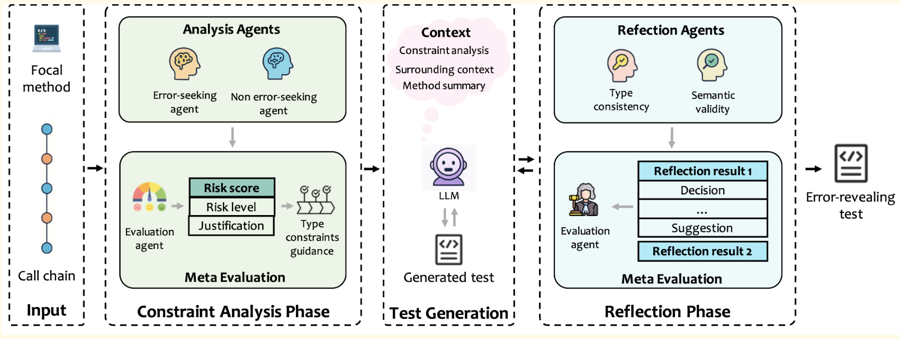

# RTED

This is the implementation of **RTED**: *Reflective Unit Test Generation for Precise Type Error Detection with Large Language Models*.

## Introduction

Type errors in Python often lead to runtime failures, posing significant challenges to software reliability and developer productivity. While static analysis tools aim to detect such errors without code execution, they frequently suffer from high false positive rates.
Recently, unit test generation techniques have shown promise in achieving high coverage, but they often struggle to produce **bug-revealing** tests without tailored guidance.
To address these limitations, we propose **RTED**, a novel **type-aware test generation framework** for automatically detecting Python type errors. RTED combines **step-by-step type constraint analysis** with **reflective validation** to guide test generation and effectively suppress false positives.


<p align="center"><b>Figure 1:</b> Overview of RTED</p>

## Repository Structure

```
RTED
│
├── core/                  # Core definitions (e.g., LLM interface, unit test abstractions)
├── data/                  # Experimental data and configuration files
├── utils/                 # Utility scripts
└── src/                   # Main implementation
    ├── setup_projects/        # Scripts to set up benchmark projects
    ├── constraint_analysis/   # Type constraint analysis logic
    └── test_generation/       # Test generation and reflective validation
```

## Configuration

Edit `data/configurations.py` to specify your paths and model details.

```python
# LLM configuration for test generation
api_key = 'your_api_key'
base_url = 'https://api.url.com'
model = "deepseek-ai/DeepSeek-V3"
temperature = 0

# LLM configuration for reflective validation
verification_api_key = 'your_verification_api_key'
verification_base_url = 'https://verification.api.url.com'
verification_model = "deepseek-ai/DeepSeek-V3"
verification_temperature = 0

# Environment paths
code_base = '/absolute/path/to/this/codebase'
conda_base = '/root/anaconda3'
```

The specific prompts used for type inference and generation can also be found in this file.

## Benchmark Setup

To fully reproduce our evaluation, you’ll need to set up the [BugsInPy](https://github.com/soarsmu/BugsInPy) and [TypeBugs](https://github.com/SerVal-DTF/TypeBugs) benchmarks. Alternatively, you may skip this step and use the preprocessed data provided in the `data/` folder.

### Step-by-step Instructions

```bash
cd src/setup_projects
```

1. Preprocess the benchmark data:

```bash
python preprocess_bugs_in_py.py
python preprocess_typebugs.py
```

2. Extract focal methods:

```bash
python extract_triggering_focal_method_bugsinpy.py    # Buggy methods from BugsInPy
python extract_triggering_focal_method_typebugs.py    # Buggy methods from TypeBugs
python extract_triggering_focal_method_nonbuggy.py    # Non-buggy methods from both
```

3. Process call chains (needed for constraint analysis):

```bash
python process_call_chain_bugsinpy.py
python process_call_chain_typebugs.py
```

## Running RTED

### 1. Type Constraint Analysis

```bash
cd src/constraint_analysis
```

```bash
python run_type_inference_buggy.py       # Buggy methods (for both datasets)
python run_type_inference_non_buggy.py   # Non-buggy methods
```

### 2. Test Generation and Reflection

```bash
cd ../test_generation
```

```bash
python our_chain_gen_buggy.py
python our_chain_gen_non_buggy.py
```

These scripts perform test generation, execution, and reflective refinement. Results will be saved under the `data/` directory.

### Note

In each script, the `__main__` section contains configuration options:

```python
run_rethink = False  # Whether to enable reflection

run_datasets = ['bugs_in_py', 'typebugs']  # Datasets to evaluate
chain_types = ['iterative', 'separate']   # Constraint analysis strategies
```

## Coming Soon

We plan to release a Docker image for easy setup and reproducibility.
